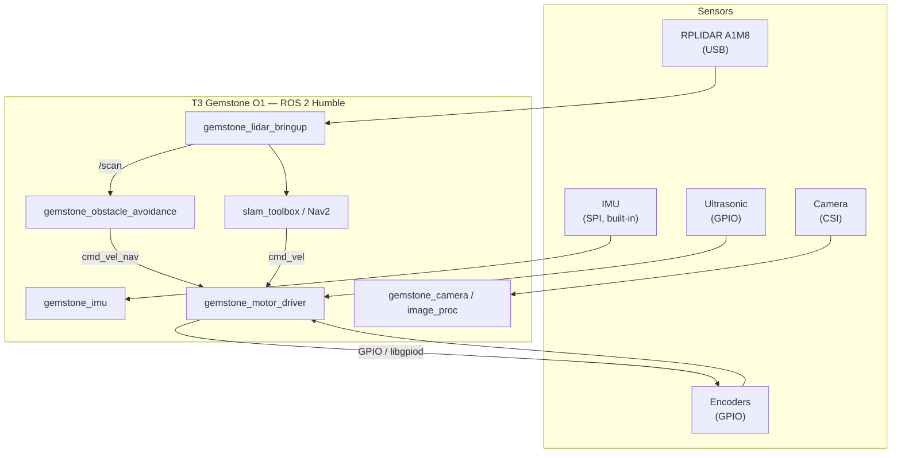

## 1. Overview

The architecture described on this page is based on an open-source unmanned ground vehicle (UGV)
built entirely with ROS 2 (Humble) on the T3 Gemstone O1 board. Instead of a classic autopilot stack
(ArduPilot, PX4, etc.), all the hardware — motor driver, encoders, ultrasonic sensors, camera — is
driven directly through the Gemstone's GPIO and peripherals using ROS 2 nodes.

This page gives a general overview of this architecture and its relationship to the Gemstone board;
the full step-by-step guide, from setup to running, is available in the documentation repository
linked in the Useful Links section at the end of the page.

## 2. Why a Single Board, No Separate Microcontroller?

The core decision behind this architecture is that a single board (the Gemstone O1) takes on all
sensor and actuator duties. No separate microcontroller board (Arduino, ESP32, etc.) is used — even
the motor driver replaces the microcontroller that would normally sit on the motor+encoder board,
running instead directly off the Gemstone's own GPIOs. This approach simplifies the system since
bring-up happens within a single Linux environment, and because each layer can be independently
enabled or disabled through launch arguments (`enable_imu`, `enable_motor_driver`, `enable_camera`,
`enable_lidar_stack`), field testing can be done incrementally.

## 3. Hardware Connections

| Component | Interface | Note |
|---|---|---|
| IMU (ICM-20948) | SPI (`/dev/spidev0.3`) | Soldered onto the board, built-in — no extra wiring needed |
| Lidar (RPLIDAR A1M8) | USB | Over the CP2102 USB-to-serial chip |
| Camera | CSI0 / CSI1 | Supports modules such as IMX219 / OV5640 |
| Motor + Encoder | GPIO (`libgpiod`) | No separate motor driver microcontroller |
| Ultrasonic Sensors | GPIO (`libgpiod`) | Two lines per Trig/Echo pair |

The built-in IMU uses GPIO7, GPIO8, GPIO9, GPIO10, and GPIO11 over the SPI0 interface; these five pins
must not be used for motor, encoder, or ultrasonic connections. See the [GPIO](/en/boards/o1/peripherals/gpio)
page for GPIO chip/line discovery and general usage, and the [IMU](/en/boards/o1/peripherals/imu) page
for more on the built-in IMU. The full project-specific pin map (line numbers, physical pin mapping,
and the 40-pin header diagram) is covered in detail in the documentation repository.

## 4. Software Stack

Each hardware block / responsibility lives in its own independent ROS 2 package; since standard ROS
message types (`sensor_msgs`, `geometry_msgs`, `nav_msgs`) are used, off-the-shelf tools like
`teleop_twist_keyboard`, `rqt`, Nav2, and `slam_toolbox` work directly without any extra remapping.

| Package | Role |
|---|---|
| `gemstone_imu` | IMU driver, publishes `imu/data_raw` |
| `gemstone_motor_driver` | Motor + encoder control over GPIO, listens to `cmd_vel`, publishes `wheel_odom` |
| `gemstone_ultrasonic` | Ultrasonic distance sensors, publishes `ultrasonicN/range` |
| `gemstone_camera` | Camera driver, publishes `camera/image_raw` |
| `gemstone_image_proc` | Image processing, publishes `camera/image_processed` |
| `gemstone_lidar_bringup` | Lidar + `rf2o` odometry + SLAM/Nav2 integration |
| `gemstone_obstacle_avoidance` | Safety/decision layer based on lidar data |
| `gemstone_bringup` | URDF, parameter files, and the master launch tying the whole system together |

## 5. System Architecture



## 6. Running

Instead of bringing up the whole system at once with `bringup.launch.py` the first time, each piece
of hardware is first tested on its own with its corresponding node (IMU → motor driver → ultrasonic →
camera → lidar → SLAM); this way, if something goes wrong, you can immediately tell which layer is
causing it. Once every layer has been verified, the system is brought up with a single master launch
file that turns each subsystem on or off with an `enable_*` argument. For step-by-step commands and
parameter files, see the [Running](https://github.com/alitalhq/t3gemstone-bumin-ika-docs/blob/main/docs/en/05-running.md)
page in the documentation repository.

## 7. Building Your Own UGV With This Method

The core idea behind this architecture is that every sensor/actuator is added following the same
five-step pattern. By following this pattern, you can build your own modular UGV on the Gemstone:

<Steps>
  <Step title="Wire the hardware">
    Connect the sensor/actuator to GPIO (or a suitable interface such as I2C/SPI/UART). Find a free
    chip/line with `gpiodetect` and `gpioinfo`; don't touch pins reserved by the system (such as the
    SPI0 lines used by the IMU) listed on the [GPIO](/en/boards/o1/peripherals/gpio) page.
  </Step>
  <Step title="Verify the hardware with raw commands">
    Before writing any code, confirm the hardware actually works; this makes it much easier to later
    tell whether a problem is in the hardware or in the code.

    ```bash
    gpioget <chip> <line>
    gpioset <chip> <line>=1
    gpiomon <chip> <line>
    ```
  </Step>
  <Step title="Write a node: separate pure logic from hardware">
    A three-file structure is recommended: a pure `<sensor>_math.py` with no ROS or hardware
    dependency, testable with `pytest`; a `<sensor>_driver.py` containing the actual `gpiod` calls,
    with its import guarded by `try/except`; and a `<sensor>_node.py` that reads parameters and
    publishes the topic. Using standard ROS message types (`sensor_msgs`, `geometry_msgs`,
    `nav_msgs`) lets off-the-shelf tools like `rqt`, Nav2, and `slam_toolbox` work without any extra
    remapping.

    ```python
    try:
        import gpiod
    except ImportError:  # pragma: no cover - off Linux/the board
        gpiod = None
    ```
  </Step>
  <Step title="Add a parameter file">
    Don't hard-code hardware-specific values like the GPIO chip/line; leave them as placeholders in a
    YAML file.

    ```yaml
    <sensor>_node:
      ros__parameters:
        gpio_chip: ''      # to be filled in with gpiodetect
        <pin_name>_line: -1 # to be filled in with gpioinfo
    ```
  </Step>
  <Step title="Wire it into the master launch file and run it">
    Add the new node to the master launch file with an `enable_<sensor>` argument that defaults to
    `false`. This way each subsystem can be turned on or off independently; test the node on its own
    first, then together with the rest of the system.
  </Step>
</Steps>

Since each step is independent, adding a new sensor or changing an existing one doesn't affect the
other nodes. This turns any UGV built with this method into an easily extensible, modular development
environment on a single Gemstone O1 board.

## 8. Useful Links

- [Source Code](https://github.com/alihaydarsucu/t3gemstone-bumin-ika) — ROS 2 packages, launch files, and parameter templates
- [Full Documentation](https://github.com/alitalhq/t3gemstone-bumin-ika-docs) — Setup, GPIO pin map, running, and known issues (TR/EN)
- [GPIO](/en/boards/o1/peripherals/gpio) — GPIO chip/line discovery and general usage
- [IMU](/en/boards/o1/peripherals/imu) — The built-in ICM-20948 IMU interface
