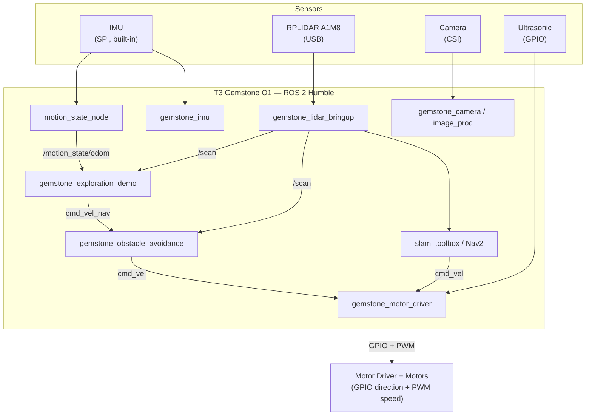

## 1. Overview

This project is an open-source example showing that the T3 Gemstone O1 board can run an unmanned
ground vehicle (UGV) end to end on its own — no separate microcontroller or autopilot board
required. The motor driver, ultrasonic sensor, camera, and lidar are all driven directly through
the Gemstone's GPIO and peripherals using ROS 2 (Humble) nodes.

This page gives a general overview of the architecture and walks through building the same project
from scratch, step by step. For the full source and comprehensive documentation, see the Useful
Links section at the end of the page.

## 2. Hardware Connections

| Component | Interface | Note |
|---|---|---|
| IMU (ICM-20948) | SPI (`/dev/spidev0.3`) | Soldered onto the board, built-in — no extra wiring needed |
| Lidar (RPLIDAR A1M8) | USB | Over the CP2102 USB-to-serial chip |
| Camera (optional) | CSI0 / CSI1 | Supports modules such as IMX219 / OV5640 |
| Motor Driver | GPIO direction + PWM speed (`libgpiod` + sysfs PWM) | This example uses an L298N, but another driver works too |
| Ultrasonic Sensors (optional) | GPIO (`libgpiod`) | Two lines per Trig/Echo pair |

The built-in IMU uses GPIO7, GPIO8, GPIO9, GPIO10, and GPIO11 over the SPI0 interface; these five pins
must not be used for the motor driver or ultrasonic connections. See the [GPIO](/en/boards/o1/peripherals/gpio)
page for GPIO chip/line discovery and general usage, and the [IMU](/en/boards/o1/peripherals/imu) page
for more on the built-in IMU. The full project-specific pin map (line numbers, physical pin mapping,
PWM channels, and the 40-pin header diagram) is covered in detail in the documentation repository.

## 3. Software Architecture

Each hardware block / responsibility lives in its own independent ROS 2 package; since standard ROS
message types (`sensor_msgs`, `geometry_msgs`, `nav_msgs`) are used, off-the-shelf tools like
`teleop_twist_keyboard`, `rqt`, Nav2, and `slam_toolbox` work directly without any extra remapping.

| Package | Role |
|---|---|
| `gemstone_imu` | IMU driver, publishes `imu/data_raw` |
| `gemstone_motor_driver` | Motor control over GPIO+PWM (listens to `cmd_vel`), plus IMU-based `motion_state_node` (publishes `motion_state/odom`) |
| `gemstone_ultrasonic` | Ultrasonic distance sensors, publishes `ultrasonicN/range` |
| `gemstone_camera` | Camera driver, publishes `camera/image_raw` |
| `gemstone_image_proc` | Image processing, publishes `camera/image_processed` |
| `gemstone_lidar_bringup` | Lidar + `rf2o` odometry + SLAM/Nav2 integration |
| `gemstone_obstacle_avoidance` | Safety/decision layer based on lidar data |
| `gemstone_exploration_demo` | Autonomous exploration based on lidar + `motion_state` (state-machine and simple threshold-based alternatives) |
| `gemstone_sim` | Hardware-free Gazebo simulation |
| `gemstone_bringup` | URDF, parameter files, and the master launch tying the whole system together |

## 4. System Architecture



## 5. Building This Project

The steps below walk through setting up and running this exact project from scratch on your own
Gemstone O1 board. The motor driver used here is an **L298N**; if you have a different driver, just
adapt the wiring to your driver's pin logic.

<Steps>
  <Step title="Pull the software">
    Clone the main code repository:

    ```bash
    git clone https://github.com/alihaydarsucu/t3gemstone-bumin-ika.git
    cd t3gemstone-bumin-ika
    ```

    For flashing the T3 Gemstone O1 and installing ROS 2 Humble, follow the setup pages in the
    [documentation repository](https://github.com/alitalhq/t3gemstone-bumin-ika-docs) first.
  </Step>
  <Step title="Gather the hardware">
    - T3 Gemstone O1
    - 2x geared DC motor + wheel, 1x caster wheel
    - 1x motor driver (L298N or a similar dual H-bridge module)
    - 1x battery, 1x switch (to cut the battery line)
    - 1x RPLIDAR A1M8
    - (optional) an ultrasonic distance sensor, a CSI camera module

    
  </Step>
  <Step title="Wire it up">
    The IMU comes soldered onto the board, so no extra wiring is needed; the lidar connects over
    USB. The motor driver's (L298N) direction pins (IN1-4) and PWM pins (ENA/ENB) connect to the
    Gemstone's GPIOs, and its power input connects through the battery + switch.

    
    
    

    For the full pin map (line numbers, physical pin mapping, PWM channels, and the 40-pin header
    diagram), see the
    [Hardware Connections](https://github.com/alitalhq/t3gemstone-bumin-ika-docs/blob/main/docs/en/04-hardware-connections.md)
    page in the documentation repository.
  </Step>
  <Step title="Build and run">
    ```bash
    colcon build --symlink-install
    source install/setup.bash
    ```

    Instead of bringing up the whole system at once with a single launch file, we recommend first
    testing each piece of hardware on its own with its corresponding node (IMU → motor driver →
    lidar → ...); this way, if something goes wrong, you can immediately tell which layer is causing
    it. Once every layer has been verified:

    ```bash
    ros2 launch gemstone_bringup bringup.launch.py
    ```

    For step-by-step commands, parameter files, and issues you might run into, see the
    [Running](https://github.com/alitalhq/t3gemstone-bumin-ika-docs/blob/main/docs/en/05-running.md)
    and
    [Known Issues](https://github.com/alitalhq/t3gemstone-bumin-ika-docs/blob/main/docs/en/09-known-issues-and-fixes.md)
    pages in the documentation repository.
  </Step>
</Steps>

## 6. Useful Links

- [Source Code](https://github.com/alihaydarsucu/t3gemstone-bumin-ika) — ROS 2 packages, launch files, and parameter templates
- [Full Documentation](https://github.com/alitalhq/t3gemstone-bumin-ika-docs) — Setup, GPIO pin map, running, and known issues (TR/EN)
- [GPIO](/en/boards/o1/peripherals/gpio) — GPIO chip/line discovery and general usage
- [IMU](/en/boards/o1/peripherals/imu) — The built-in ICM-20948 IMU interface
