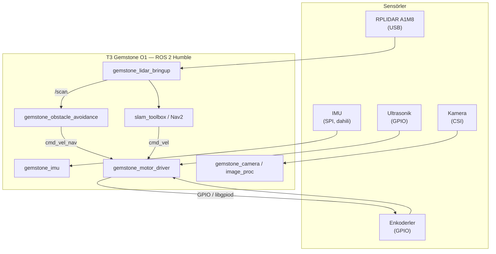

## 1. Genel Bakış

Bumin İKA, T3 Gemstone O1 kartı üzerinde tamamen ROS 2 (Humble) ile geliştirilen açık kaynaklı bir
insansız kara aracı (İKA) projesidir. Klasik bir otopilot yazılımı (ArduPilot, PX4 vb.) kullanmak
yerine motor sürücü, enkoder, ultrasonik sensör ve kamera gibi tüm donanım doğrudan Gemstone'un GPIO
ve çevre birimleri üzerinden ROS 2 node'larıyla sürülür.

- **Kaynak kod**: [github.com/alihaydarsucu/t3gemstone-bumin-ika](https://github.com/alihaydarsucu/t3gemstone-bumin-ika)
- **Kapsamlı dokümantasyon**: [github.com/alitalhq/t3gemstone-bumin-ika-docs](https://github.com/alitalhq/t3gemstone-bumin-ika-docs)

Bu sayfa projenin mimarisine ve Gemstone kartıyla ilişkisine genel bir bakış sunar; kurulumdan
çalıştırmaya kadar adım adım anlatılan tam rehber yukarıdaki dokümantasyon reposunda bulunur.

## 2. Neden Tek Kart, Ayrı Mikrodenetleyici Yok

Projenin temel mimari kararı, tek bir kartın (Gemstone O1) tüm sensör ve eyleyici görevlerini
üstlenmesidir. Ayrı bir mikrodenetleyici kart (Arduino, ESP32 vb.) kullanılmaz — motor sürücü bile,
Bumin motor+enkoder kartındaki mikrodenetleyicinin yerini alarak Gemstone'un kendi GPIO'larından
çalışır. Bu yaklaşım, açılışın tek bir Linux ortamında gerçekleşmesini sağlayarak sistemi
sadeleştirir ve her katmanın (`enable_imu`, `enable_motor_driver`, `enable_camera`,
`enable_lidar_stack` gibi launch argümanlarıyla) bağımsız açılıp kapanabilmesi sayesinde kademeli
saha testine imkân tanır.

## 3. Donanım Bağlantıları

| Bileşen | Arayüz | Not |
|---|---|---|
| IMU (ICM-20948) | SPI (`/dev/spidev0.3`) | Karta lehimli, dahili — ek kablo gerekmez |
| Lidar (RPLIDAR A1M8) | USB | CP2102 USB-Seri çipi üzerinden |
| Kamera | CSI0 / CSI1 | IMX219 / OV5640 gibi modülleri destekler |
| Motor + Enkoder | GPIO (`libgpiod`) | Ayrı bir motor sürücü mikrodenetleyicisi yok |
| Ultrasonik Sensörler | GPIO (`libgpiod`) | Trig/Echo çifti başına iki hat |

Dahili IMU, SPI0 arayüzü üzerinden GPIO7, GPIO8, GPIO9, GPIO10 ve GPIO11 pinlerini kullanır; bu beş
pin motor, enkoder veya ultrasonik bağlantıları için kullanılmamalıdır. GPIO chip/line keşfi ve genel
kullanım için [GPIO](/tr/boards/o1/peripherals/gpio) sayfasına, IMU hakkında daha fazla bilgi için
[IMU](/tr/boards/o1/peripherals/imu) sayfasına bakabilirsiniz. Projeye özel tam pin haritası (line
numaraları, fiziksel pin karşılıkları ve 40-pin header diyagramı) dokümantasyon reposunda ayrıntılı
olarak yer alır.

## 4. Yazılım Yığını

Her donanım/görev kendi bağımsız ROS 2 paketinde yaşar; standart ROS mesaj tipleri (`sensor_msgs`,
`geometry_msgs`, `nav_msgs`) kullanıldığı için `teleop_twist_keyboard`, `rqt`, Nav2 ve
`slam_toolbox` gibi hazır araçlar ek bir remap yapılmadan doğrudan çalışır.

| Paket | Görev |
|---|---|
| `gemstone_imu` | IMU sürücüsü, `imu/data_raw` yayını |
| `gemstone_motor_driver` | GPIO üzerinden motor + enkoder kontrolü, `cmd_vel` dinler, `wheel_odom` yayınlar |
| `gemstone_ultrasonic` | Ultrasonik mesafe sensörleri, `ultrasonicN/range` yayını |
| `gemstone_camera` | Kamera sürücüsü, `camera/image_raw` yayını |
| `gemstone_image_proc` | Görüntü işleme, `camera/image_processed` yayını |
| `gemstone_lidar_bringup` | Lidar + `rf2o` odometri + SLAM/Nav2 entegrasyonu |
| `gemstone_obstacle_avoidance` | Lidar verisine dayalı güvenlik/karar katmanı |
| `gemstone_bringup` | URDF, parametre dosyaları ve tüm sistemi birleştiren master launch |

## 5. Sistem Mimarisi

## 6. Çalıştırma

Sistemi ilk seferde `bringup.launch.py` ile birden açmak yerine, her donanım kendi node'uyla önce
tek başına test edilir (IMU → motor sürücü → ultrasonik → kamera → lidar → SLAM); bu sayede bir sorun
çıktığında hangi katmandan kaynaklandığı hemen anlaşılır. Tüm katmanlar doğrulandıktan sonra sistem,
her alt sistemi bir `enable_*` argümanıyla açıp kapatan tek bir master launch dosyasıyla ayağa
kaldırılır. Adım adım komutlar ve parametre dosyaları için dokümantasyon reposundaki
[Çalıştırma](https://github.com/alitalhq/t3gemstone-bumin-ika-docs/blob/main/docs/tr/05-calistirma.md)
sayfasına bakınız.

## 7. Kaynak ve Dokümantasyon

<CardGroup cols={2}>
  <Card title="Kaynak Kod" icon="github" href="https://github.com/alihaydarsucu/t3gemstone-bumin-ika">
    ROS 2 paketleri, launch dosyaları ve parametre şablonları
  </Card>
  <Card title="Tam Dokümantasyon" icon="book" href="https://github.com/alitalhq/t3gemstone-bumin-ika-docs">
    Kurulum, GPIO pin haritası, çalıştırma ve bilinen sorunlar (TR/EN)
  </Card>
  <Card title="GPIO" icon="microchip" href="/tr/boards/o1/peripherals/gpio">
    GPIO chip/line keşfi ve genel kullanım
  </Card>
  <Card title="IMU" icon="compass" href="/tr/boards/o1/peripherals/imu">
    ICM-20948 dahili IMU arayüzü
  </Card>
</CardGroup>
