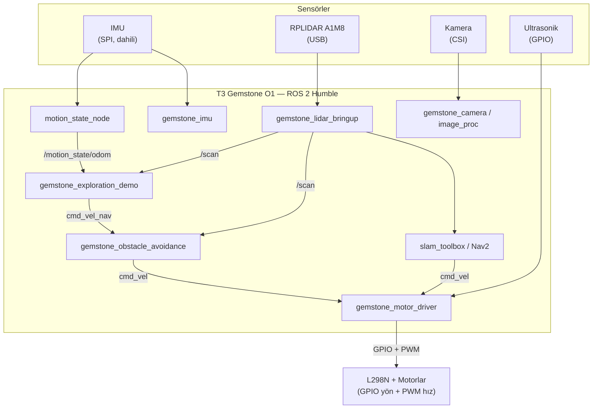

## 1. Genel Bakış

Bu sayfada anlatılan mimari, T3 Gemstone O1 kartı üzerinde tamamen ROS 2 (Humble) ile geliştirilen
açık kaynaklı bir insansız kara aracı (İKA) örneğine dayanır. Klasik bir otopilot yazılımı
(ArduPilot, PX4 vb.) kullanmak yerine motor sürücü, enkoder, ultrasonik sensör ve kamera gibi tüm
donanım doğrudan Gemstone'un GPIO ve çevre birimleri üzerinden ROS 2 node'larıyla sürülür.

Bu sayfa bu mimariye ve Gemstone kartıyla ilişkisine genel bir bakış sunar; kurulumdan çalıştırmaya
kadar adım adım anlatılan tam rehber, sayfa sonundaki Yararlı Bağlantılar bölümünde verilen
dokümantasyon reposunda bulunur.

## 2. Neden Tek Kart, Ayrı Mikrodenetleyici Yok?

Bu mimarinin temel kararı, tek bir kartın (Gemstone O1) tüm sensör ve eyleyici görevlerini
üstlenmesidir. Ayrı bir mikrodenetleyici kart (Arduino, ESP32 vb.) kullanılmaz — motor sürücü bile,
motor+enkoder kartındaki mikrodenetleyicinin yerini alarak Gemstone'un kendi GPIO'larından
çalışır. Bu yaklaşım, açılışın tek bir Linux ortamında gerçekleşmesini sağlayarak sistemi
sadeleştirir ve her katmanın (`enable_imu`, `enable_motor_driver`, `enable_camera`,
`enable_lidar_stack` gibi launch argümanlarıyla) bağımsız açılıp kapanabilmesi sayesinde kademeli
saha testine imkân tanır.

## 3. Donanım Bağlantıları

| Bileşen | Arayüz | Not |
|---|---|---|
| IMU (ICM-20948) | SPI (`/dev/spidev0.3`) | Karta lehimli, dahili — ek kablo gerekmez |
| Lidar (RPLIDAR A1M8) | USB | CP2102 USB-Seri çipi üzerinden |
| Kamera | CSI0 / CSI1 | IMX219 / OV5640 gibi modülleri destekler |
| Motor Sürücü (L298N) | GPIO yön + PWM hız (`libgpiod` + sysfs PWM) | Ayrı bir motor sürücü mikrodenetleyicisi yok; enkoder kullanılmıyor, hareket takibi IMU tabanlı |
| Ultrasonik Sensörler | GPIO (`libgpiod`) | Trig/Echo çifti başına iki hat |

Dahili IMU, SPI0 arayüzü üzerinden GPIO7, GPIO8, GPIO9, GPIO10 ve GPIO11 pinlerini kullanır; bu beş
pin motor, enkoder veya ultrasonik bağlantıları için kullanılmamalıdır. GPIO chip/line keşfi ve genel
kullanım için [GPIO](/tr/boards/o1/peripherals/gpio) sayfasına, IMU hakkında daha fazla bilgi için
[IMU](/tr/boards/o1/peripherals/imu) sayfasına bakabilirsiniz. Projeye özel tam pin haritası (line
numaraları, fiziksel pin karşılıkları ve 40-pin header diyagramı) dokümantasyon reposunda ayrıntılı
olarak yer alır.

## 4. Yazılım Yığını

Her donanım/görev kendi bağımsız ROS 2 paketinde yaşar; standart ROS mesaj tipleri (`sensor_msgs`,
`geometry_msgs`, `nav_msgs`) kullanıldığı için `teleop_twist_keyboard`, `rqt`, Nav2 ve
`slam_toolbox` gibi hazır araçlar ek bir remap yapılmadan doğrudan çalışır.

| Paket | Görev |
|---|---|
| `gemstone_imu` | IMU sürücüsü, `imu/data_raw` yayını |
| `gemstone_motor_driver` | GPIO+PWM üzerinden motor kontrolü (`cmd_vel` dinler), ve IMU tabanlı `motion_state_node` (`motion_state/odom` yayını) |
| `gemstone_ultrasonic` | Ultrasonik mesafe sensörleri, `ultrasonicN/range` yayını |
| `gemstone_camera` | Kamera sürücüsü, `camera/image_raw` yayını |
| `gemstone_image_proc` | Görüntü işleme, `camera/image_processed` yayını |
| `gemstone_lidar_bringup` | Lidar + `rf2o` odometri + SLAM/Nav2 entegrasyonu |
| `gemstone_obstacle_avoidance` | Lidar verisine dayalı güvenlik/karar katmanı |
| `gemstone_exploration_demo` | Lidar + `motion_state` tabanlı otonom keşif (durum makineli ve basit eşik tabanlı iki alternatif) |
| `gemstone_sim` | Donanımsız Gazebo simülasyonu |
| `gemstone_bringup` | URDF, parametre dosyaları ve tüm sistemi birleştiren master launch |

## 5. Sistem Mimarisi



## 6. Çalıştırma

Sistemi ilk seferde `bringup.launch.py` ile birden açmak yerine, her donanım kendi node'uyla önce
tek başına test edilir (IMU → motor sürücü → ultrasonik → kamera → lidar → SLAM); bu sayede bir sorun
çıktığında hangi katmandan kaynaklandığı hemen anlaşılır. Tüm katmanlar doğrulandıktan sonra sistem,
her alt sistemi bir `enable_*` argümanıyla açıp kapatan tek bir master launch dosyasıyla ayağa
kaldırılır. Adım adım komutlar ve parametre dosyaları için dokümantasyon reposundaki
[Çalıştırma](https://github.com/alitalhq/t3gemstone-bumin-ika-docs/blob/main/docs/tr/05-calistirma.md)
sayfasına bakınız.

## 7. Kendi İKA'nızı Bu Yöntemle Oluşturmak

Bu mimarinin asıl fikri, her sensör/eyleyicinin aynı beş adımlık kalıpla eklenmesidir. Bu kalıbı
takip ederek Gemstone üzerinde kendi modüler İKA'nızı oluşturabilirsiniz:

<Steps>
  <Step title="Donanımı bağlayın">
    Sensör/eyleyiciyi GPIO'ya (veya I2C/SPI/UART gibi uygun bir arayüze) bağlayın. `gpiodetect` ve
    `gpioinfo` ile boş bir chip/line bulun; [GPIO](/tr/boards/o1/peripherals/gpio) sayfasındaki
    sistem tarafından ayrılmış pinlere (IMU'nun kullandığı SPI0 hatları gibi) dokunmayın.
  </Step>
  <Step title="Donanımı ham komutlarla doğrulayın">
    Kod yazmadan önce donanımın gerçekten çalıştığını doğrulayın; bu, ileride bir sorun çıktığında
    donanım mı yoksa kod mu hatalı ayrımını kolaylaştırır.

    ```bash
    gpioget <chip> <line>
    gpioset <chip> <line>=1
    gpiomon <chip> <line>
    ```
  </Step>
  <Step title="Node yazın: saf mantığı donanımdan ayırın">
    Üç dosyalık bir yapı önerilir: ROS'a ve donanıma hiç dokunmayan, `pytest` ile test edilebilir bir
    `<sensor>_math.py`; gerçek `gpiod` çağrılarını içeren ve importu `try/except` ile korunan bir
    `<sensor>_driver.py`; parametreleri okuyup topic yayınlayan bir `<sensor>_node.py`. Standart ROS
    mesaj tiplerini (`sensor_msgs`, `geometry_msgs`, `nav_msgs`) kullanmak, `rqt`, Nav2 ve
    `slam_toolbox` gibi hazır araçların ek bir remap olmadan çalışmasını sağlar.

    ```python
    try:
        import gpiod
    except ImportError:  # pragma: no cover - Linux/kart dışında
        gpiod = None
    ```
  </Step>
  <Step title="Parametre dosyası ekleyin">
    GPIO chip/line gibi donanıma özgü değerleri koda gömmeyin; bir YAML dosyasında yer tutucu olarak
    bırakın.

    ```yaml
    <sensor>_node:
      ros__parameters:
        gpio_chip: ''      # gpiodetect ile doldurulacak
        <pin_adi>_line: -1 # gpioinfo ile doldurulacak
    ```
  </Step>
  <Step title="Master launch dosyasına ekleyin ve çalıştırın">
    Yeni node'u, varsayılanı `false` olan bir `enable_<sensor>` argümanıyla master launch dosyasına
    ekleyin. Böylece her alt sistem bağımsız olarak açılıp kapanabilir; önce node'u tek başına, sonra
    sistemin geri kalanıyla birlikte test edin.
  </Step>
</Steps>

Her adım bağımsız olduğu için yeni bir sensör eklemek veya var olanı değiştirmek diğer node'ları
etkilemez. Bu da bu yöntemle geliştirilecek herhangi bir İKA'yı, tek bir Gemstone O1 kartı üzerinde
kolayca genişletilebilir, modüler bir geliştirme ortamına dönüştürür.

## 8. Yararlı Bağlantılar

- [Kaynak Kod](https://github.com/alihaydarsucu/t3gemstone-bumin-ika) — ROS 2 paketleri, launch dosyaları ve parametre şablonları
- [Kapsamlı Dokümantasyon](https://github.com/alitalhq/t3gemstone-bumin-ika-docs) — Kurulum, GPIO pin haritası, çalıştırma ve bilinen sorunlar (TR/EN)
- [GPIO](/tr/boards/o1/peripherals/gpio.mdx) — GPIO chip/line keşfi ve genel kullanım
- [IMU](/tr/boards/o1/peripherals/imu.mdx) — ICM-20948 dahili IMU arayüzü
